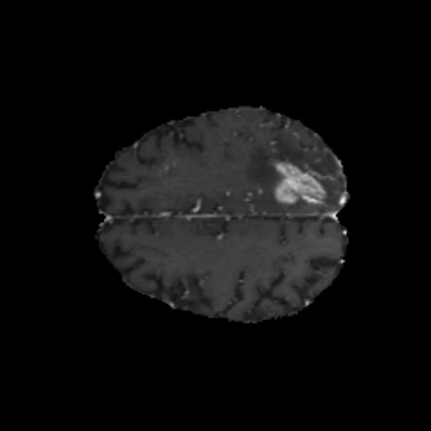
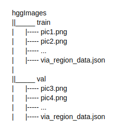
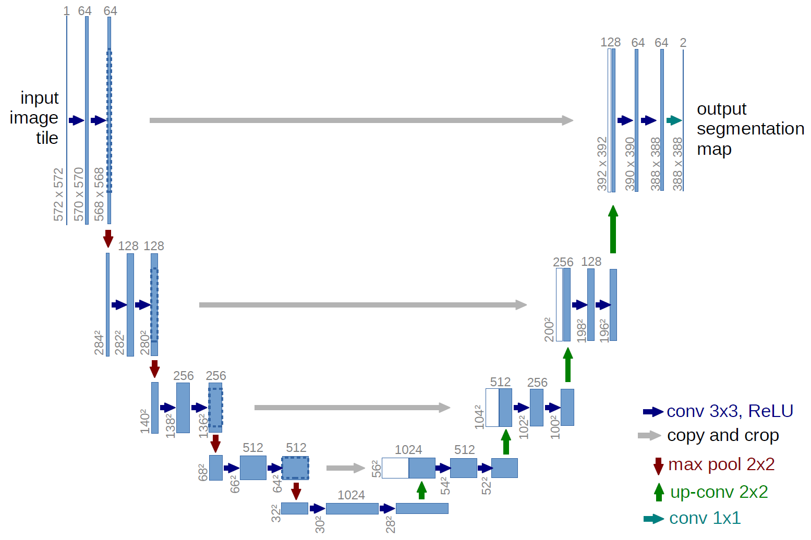
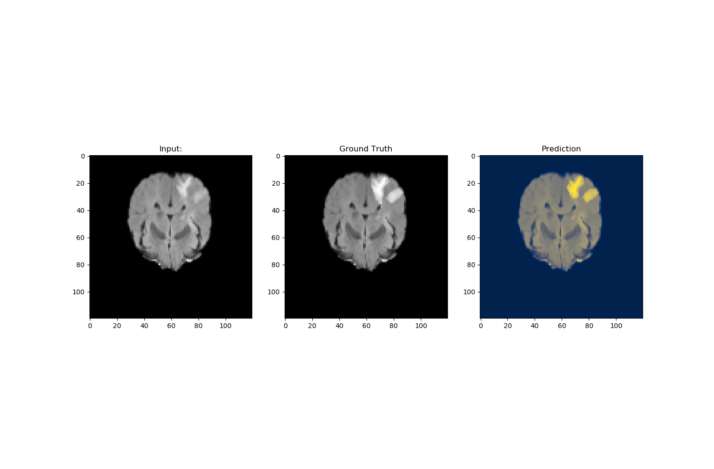
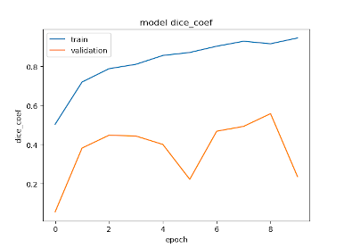
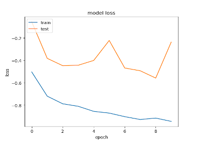
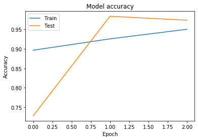

# DeepHealth

  
Our team consisted of [Mustafa Mert TUNALI](https://github.com/mustafamerttunali), [Merve TURAN](https://github.com/mrvturan96), [Feyza DOĞAN](https://github.com/afeyzadogan) 
Istanbul,TURKEY

DeepHealth - project is created in Project Oriented Deep Learning Training program. The program is organized by [Deep Learning Türkiye](https://github.com/deeplearningturkiye) and supported by KWORKS.

The repository includes:
* Source code of Mask R-CNN built on FCN and ResNet101.
* Source code of U-net
* Instruction and training code for the BraTS dataset.
* Pre-trained weights on MS COCO.
* Jupyter notebooks to visualize the detection result for Mask RCNN.

 


## Introduction

The aim of this project is to distinguish gliomas which are the most difficult brain tumors to be detected with deep learning algorithms. Because, for a skilled radiologist, analysis of multimodal MRI scans can take up to 20 minutes and therefore, making this process automatic is obviously useful. 

MRI can show different tissue contrasts through different pulse sequences, making it an adaptable and widely used imaging technique for visualizing regions of interest in the human brain. 
Gliomas are the most commonly found tumors having irregular shape and ambiguous boundaries, making them one of the hardest tumors to detect. Detection of brain tumor using a segmentation approach is critical in cases, where survival of a subject depends on an accurate and timely clinical diagnosis.  

We present a fully automatic deep learning approach for brain tumor segmentation in multi-contrast magnetic resonance image. 

#### [U-Net weights and Mask-RCNN models](https://drive.google.com/drive/folders/1b5_nN-6a0a_uYxxESsEpDpLf3HGkkOqg?usp=sharing)


## Mask-RCNN

### Requirements
```buildoutcfg
- Numpy
- Scipy
- Pillow
- Cython
- Matplotlib
- Scikit-image
- Tensorflow>=1.3.0
- Keras>=2.0.8
- OpenCV-Python
- h5py
- imgaug
- IPython[all]
```
[Install Mask RCNN from here.](https://github.com/matterport/Mask_RCNN#installation)

_**1. Prepare Data**_
  
  Download and unzip BraTS data from [braTS2019](https://www.med.upenn.edu/cbica/brats2019.html)
    
  Biomedical images generally have NIFTI format. NIFTI format is very high resolution. Therefore, we've converted these images to .png format. Before you start to train the model, you have to convert nii files to png. 

  These dataset contains only **t1ce** sequence.
  
  The data directories for this project are as following. Make sure you include corresponding annotations(.json) in correct directory. Train has **564** images. Val has **100** images.
  

  
  
  
  ***Note:*** VIA tool is used to label.
    
_**2. Build Model**_

Mask-RCNN/hgg.py shows how to train Mask R-CNN on HGG dataset.

```buildoutcfg
#From Brain-Cancer-Detection-using-Pathological-Images/Mask-RCNN
python3 hgg.py train --dataset=/Brain-Cancer-Detection-using-Pathological-Images/Mask-RCNN/hggImages --weights=coco
```

* inspect_hgg_data.ipynb provides step-by-step prediction and visualization on your own dataset. You can also roughly evaluate the model with metrics of overall accuracy and precision.

### Results

   
<sub><b>Figure 1: </b> Prediction of our solution with Mask R-CNN </sub>

    
<sub><b>Figure 2: </b> Prediction of our solution with Mask R-CNN </sub>

## U-NET

### Requirements

```buildoutcfg
- Keras 2.2.4
- Tensorflow 1.13.1
- Matplotlib
- SimpleITK
- Numpy
```

### Usage and Tips

_**1. Prepare Data**_
  
  Download and unzip BraTS data from [braTS2019](https://www.med.upenn.edu/cbica/brats2019.html)
  
  **NOTE:** BraTS dataset is in NIFTI format. So, this images have high resolution. We used the SimpleITK library to read images in this format.    
  Images = 240x240 pixel and 60–120 slides of each MRI image are used as training data due to the rest part of brain is very unlikely to have any tumor.    
  U-Net contains only **flair** sequence. But other sequences can also be easily applied. We only use **LGG** images.
 
_**2. Data Augmentation**_

   We don't have many images. Therefore, data augmentation applied.
   
_**3. Build Model**_

  We use only one U-net model to do three different segmentation tasks Full Tumor, Tumor Core, Enhancing Tumor. 
  
       
  <sub><b>Figure 3: </b> U-net Architecture </sub> 
  
### Results

   
<sub><b>Figure 4: </b> Prediction of our solution with U-Net </sub>

  
### Details

_**Dice Metrics**_

Dice is a frequently used performance criterion to evaluate success in biomedical images.


Dice Coef             |  Dice Loss
:-------------------------:|:-------------------------:
  |  
        
_**Binary Crossentropy**_    


Model Accuracy             |  Model Loss
:-------------------------:|:-------------------------:
  |                   
 
 
## Contributing

Contributions with example scripts for other frameworks are welcome!


## References

- [1] B. H. Menze, A. Jakab, S. Bauer, J. Kalpathy-Cramer, K. Farahani, J. Kirby, et al. "The Multimodal Brain Tumor Image Segmentation Benchmark (BRATS)", IEEE Transactions on Medical Imaging 34(10), 1993–2024 (2015) DOI: 10.1109/TMI.2014.2377694

- [2] S. Bakas, H. Akbari, A. Sotiras, M. Bilello, M. Rozycki, J.S. Kirby, et al., "Advancing The Cancer Genome Atlas glioma MRI collections with expert segmentation labels and radiomic features", Nature Scientific Data, 4:170117 (2017) DOI: 10.1038/sdata.2017.117

- [3] S. Bakas, M. Reyes, A. Jakab, S. Bauer, M. Rempfler, A. Crimi, et al., "Identifying the Best Machine Learning Algorithms for Brain Tumor Segmentation, Progression Assessment, and Overall Survival Prediction in the BRATS Challenge", arXiv preprint arXiv:1811.02629 (2018)

- [4] S. Bakas, H. Akbari, A. Sotiras, M. Bilello, M. Rozycki, J. Kirby, et al., "Segmentation Labels and Radiomic Features for the Pre-operative Scans of the TCGA-GBM collection", The Cancer Imaging Archive, 2017. DOI: 10.7937/K9/TCIA.2017.KLXWJJ1Q

- [5] S. Bakas, H. Akbari, A. Sotiras, M. Bilello, M. Rozycki, J. Kirby, et al., "Segmentation Labels and Radiomic Features for the Pre-operative Scans of the TCGA-LGG collection", The Cancer Imaging Archive, 2017. DOI: 10.7937/K9/TCIA.2017.GJQ7R0EF

- [6] U-Net: Convolutional Networks for Biomedical Image Segmentation, https://arxiv.org/abs/1505.04597

- [7] - Intelligent Scanning Using Deep Learning for MRI, https://medium.com/tensorflow/intelligent-scanning-using-deep-learning-for-mri-36dd620882c4

- [VGG Image Annotator](http://www.robots.ox.ac.uk/~vgg/software/via/via_demo.html)

- [Mask RCNN](https://github.com/matterport/Mask_RCNN)

- github.com/zsdonghao/u-net-brain-tumor, github.com/JooHyun-Lee/BraTs


